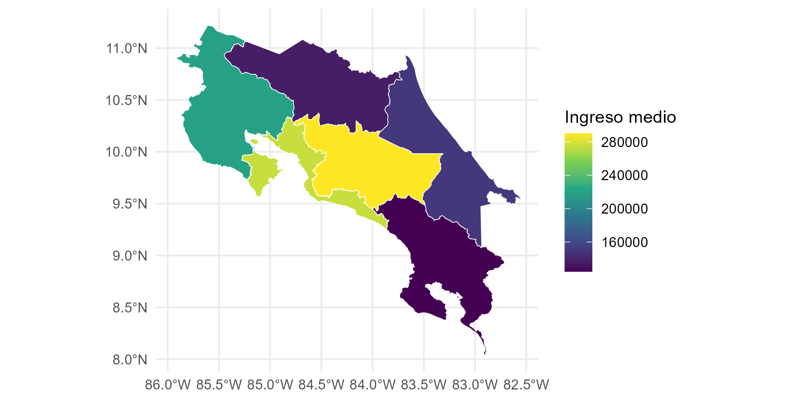

# ML-SAE-LATAM
Modelo XGBoost para la estimación de áreas pequeñas.

## Composición

Para cada uno de los países existe una carpeta. Dentro de la carpeta se encuentra los siguientes objetos:

1. archivo `.R` el cual es el archivo donde se encuentra todo el código.
2. Carpeta con fecha es donde se encuentran los archivos de datos `.rds` las transformaciones se realizan en cada uno de los archivos para cada país.
3. carpeta *output* donde se encuentran las salidas de los scripts `.R`.Aquí siempre va a existir un archivo denominado `fit.rds` el cual es el ***modelo XGBoost con efectos aleatorios***. 
También puede haber un archivo denominado `xgb_train_rmse_all.rds` el cual es el resultado de la validación cruzada para determinar los parámetros. Este también se crea y se utiliza en el archivo `.R`.

## Archivo .R

La composición del archivo de `.R` cuenta con las siguientes secciones:

1. Datos
    - Se cargan las librerías. Se realizan las transformaciones necesarias en el encuesta y el censo para crear la base agregada. 
2. Código
    - Abarca toda la sección, desde la creación del modelo y la validación cruzada. 
3. Preparaciones
    - Se extraen las variables predictoras.
4. Modelo
    - Se crea la función de pérdida establecida.
5. Validación cruzada
    - Se determinan los valores de los parámetros.
6. Bayesian Additive Regression Tree with random intercept
    - Modelo bayesiano para el benchmark del Modelo XGBoost
7. Lmer
    - Modelo lineal mixto para el benchmark del modelo XGBoost
8. Varianza y error
    - Se extraen los componentes de varianza de los efectos aleatorios y los modelos de benchmark
9. Bootstrap
    - Se realiza el boostrap no paramétrico para la estimación de la incertidumbre.
10. Mapas
    - Se realizan los mapas para la estimación del ingreso. 
Ejemplo de mapa con el ingreso medio predicho con el modelo de XGBoost.
    

